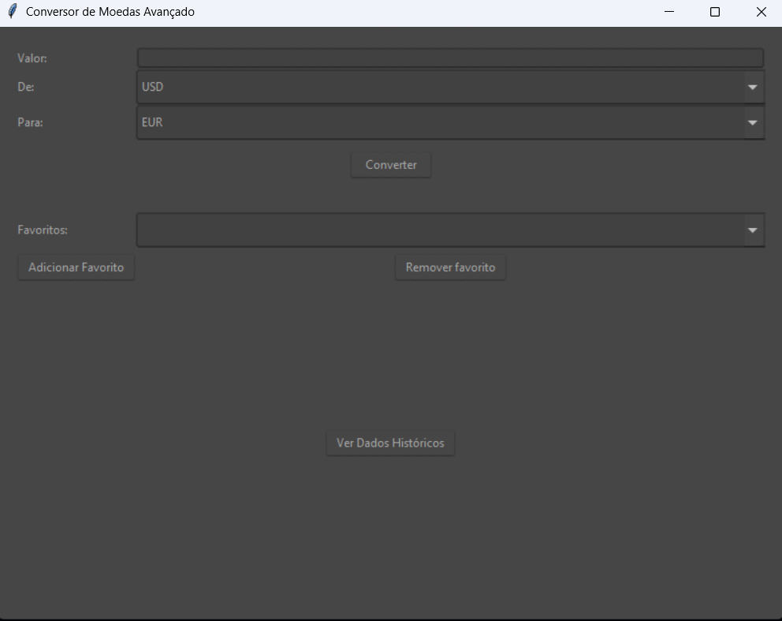

# 📌  Descrição 🐍

Este repositório contém 5 projetos simples em Python:
1. Calculadora Simples
2. Conversor de Moeda com GUI(Graphical User Interface) 
3. Gerador de Senhas Aleatórias
4. Lista de Tarefas
5. Jogo Pedra, Papel e Tesoura

## 🧮 1. Calculadora Simples

Funcionalidades:

* Operações básicas: adição, subtração, multiplicação e divisão
* Interface de linha de comando simples

Requisitos:
* Python 3.x

## 💱 2. Conversor de Moeda com GUI
* abaixo você pode ver a própria GUI:

Funcionalidades:

* Conversão entre diferentes moedas (USD, EUR, JPY, etc.)

* Interface gráfica amigável

* Atualização de taxas de câmbio (opcional)

Requisitos:
* Python 3.x 
* tkinter(biblioteca para a utilização da GUI)

## 🔐 3. Gerador de Senhas Aleatórias

Funcionalidades:

* Geração de senhas seguras com diferentes comprimentos

* Opções para incluir caracteres especiais, números e letras maiúsculas/minúsculas

* Capacidade de copiar senha para área de transferência

## ✂️ 🪨 📄 5. Jogo Pedra, Papel e Tesoura

Funcionalidades:

* Jogo contra o computador

* Placar de vitórias, derrotas e empates

* Interface simples e intuitiva

📄 Licença

Este projeto está licenciado sob a licença MIT - veja o arquivo LICENSE para detalhes.